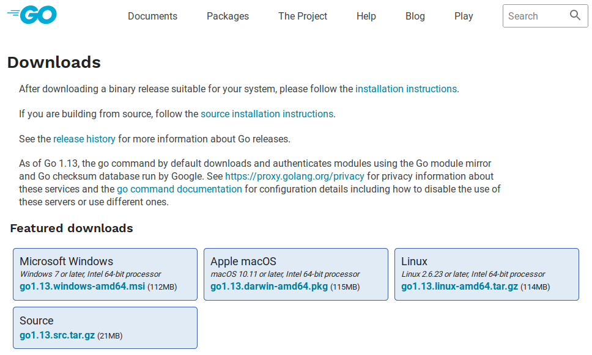
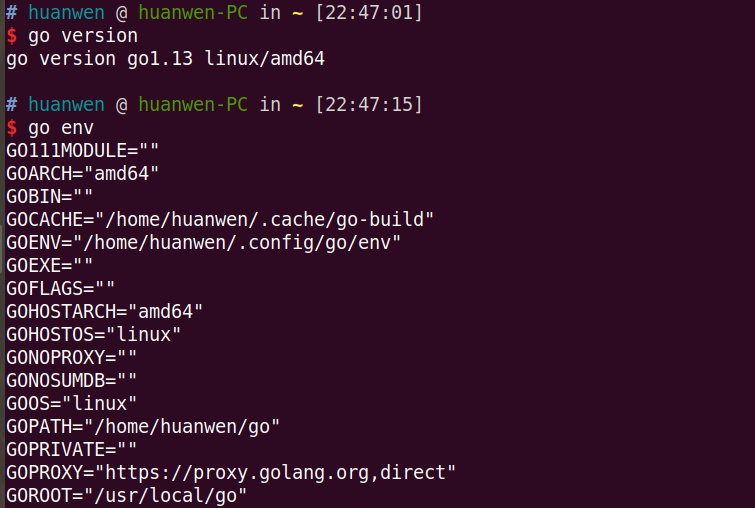
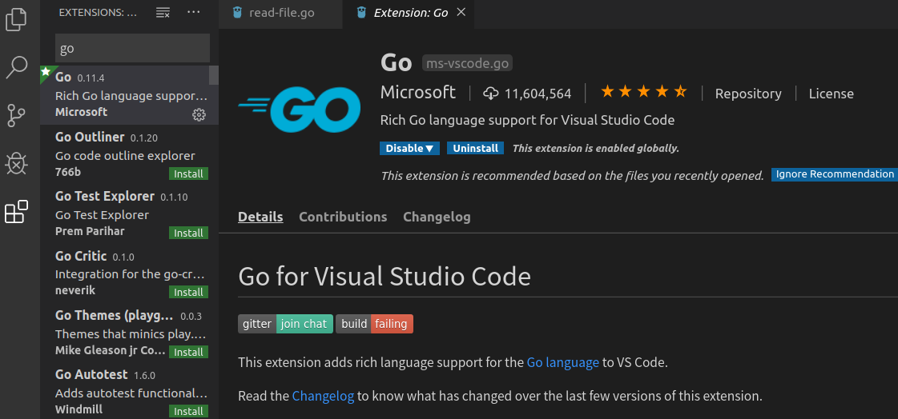
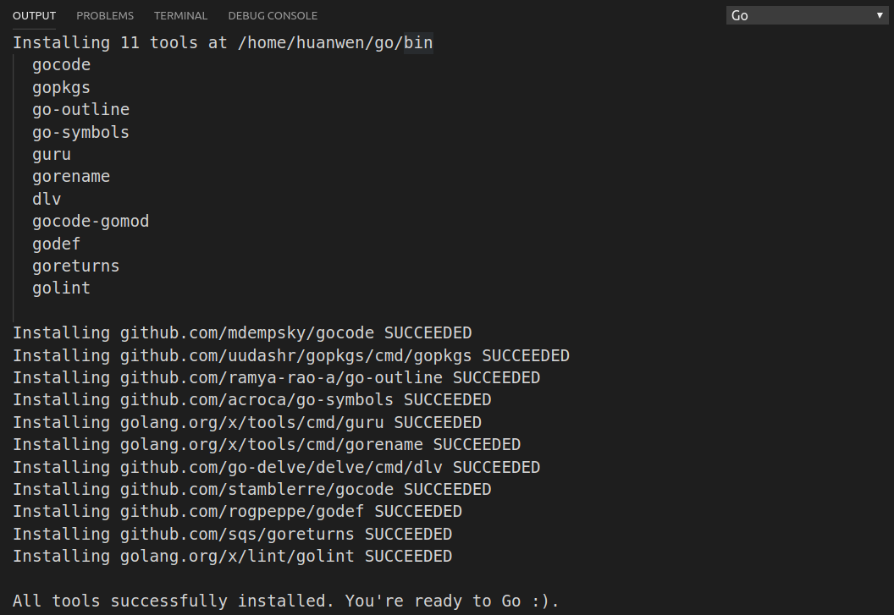

大家好，今天是鐵人賽第二天，要來介紹Go的開發環境如何安裝，以及如何執行第一支Go程式。Go支援三大平台windows, mac, linux，我是用ubuntu來開發。


## 系統需求


| 作業系統                          | 架構                                   | 備註                                                         |
| --------------------------------- | -------------------------------------- | ------------------------------------------------------------ |
| FreeBSD 10.3 or later             | amd64, 386                             | Debian GNU/kFreeBSD not supported                            |
| Linux 2.6.23 or later with glibc  | amd64, 386, arm, arm64, s390x, ppc64le | CentOS/RHEL 5.x not supported. Install from source for other libc. |
| macOS 10.10 or later              | amd64                                  | use the clang or gcc† that comes with Xcode‡ for `cgo` support |
| Windows 7, Server 2008R2 or later | amd64, 386                             | use MinGW gcc†. No need for cygwin or msys.                  |

這是官方寫的系統需求，通常現在一般電腦都是符合的。


## 環境安裝

我覺得下載安裝檔是最快的方式，當然也是可以透過軟體包管理工具進行安裝，像是用windows的chocolatey, mac的homebrew, linux的apt-get或yum，這就看每個人的習慣，只是用軟體包工具安裝的可能不會是目前的最新版本，必須要等待軟體包伺服器更新。

Go官網下載頁網址: https://golang.org/dl/



看到上圖，go支援三種作業系統windows, max, linux，其中windows和mac只要下載檔案並且執行就能完成安裝，而linux就必須要打一些指令。

打開linux終端機

``` bash
$  sudo tar -C /usr/local -xzf go1.13.linux-amd64.tar.gz
```

這一行會把下載的檔案解壓縮放到/usr/local，然後還需要新增Go工具的path。

``` bash
$  export PATH=$PATH:/usr/local/go/bin
```

這一行會立即生效，在終端機打go就會有反應，重開機就會消失，必須要修改$HOME/.profile。

``` bash 
$  vi $HOME/.profile
```

在文件中的最下方加入上面export的那一行就行了，完成後就可以輸入go version和go env看看是否已經安裝成功，如下圖所示:



go env印出的內容一開始只要注意GOROOT和GOPATH就行了(我目前也只知道這兩個)。GOROOT是Go語言的工具包，像是編譯工具、標準函式庫等等；而GOPATH是開發程式的workspace，通常是在$HOME/go，go開發者希望我們把專案都放在一個固定的地方。


## 第一個Go程式

通常學習新語言的第一支程式都是同一個情境，就是啟動程式，然後印出hello world。我們首先在GOPATH底下建立一個路徑src/hello，表示原始碼資料夾src中有一個hello應用程式目錄。

``` bash
$  cd $HOME/go
$  mkdir src
$  cd src
$  mkdir hello
$  cd hello
```

然後建立一個檔案叫做hello.go，內容為以下:

``` go
package main

import "fmt"

func main() {
	fmt.Printf("hello, world\n")
}
```

然後在終端機中執行go build，就會編譯出一個叫做hello的可執行檔，可以直接執行它。

``` bash
$  go build
$  ./hello
hello, world
```

另外，也可以用go run，這會像執行腳本語言的一樣直接執行它，不會輸出編譯檔。

``` bash
$  go run hello.go
hello, world
```

但實際上，go程式碼還是會先被編譯再執行。


## 編輯器

如果要用記事本或是vim寫程式的話，我應該會很痛苦。我身為一名C#開發者，常年使用號稱地表最強IDE的Visual Studio，深深感受到工具對於開發者的重要性。雖然聽說有神人用vim也是很強，但畢竟我只是一般人，是需要工具的輔助。因此，我喜歡用有微軟血統的編輯器Visual Studio Code，不但免費開源、外掛多，更新也很快，許多人也都很推薦。

VS Code下載網址: https://code.visualstudio.com/download

下載安裝完後，打開vs code，點選左側工具列的擴充(Extension)，搜尋go並且安裝它，如下圖:



安裝完Go的VS擴充後，可以隨便打開一個go檔案，vs code就會在右下角提示你要裝一些go的工具，一共有11個，安裝完就可以正常開發go程式，並且可以用vs code的中斷點偵錯。工具安裝的過程如下圖所示，此為vs code內建的輸出視窗。




另外，JetBrains這間專門做IDE(整合開發環境)的公司也有提供Go語言開發的IDE - GoLand，只是它不是免費軟體，但是有30天免費試用期，之後有時間可以來玩玩看。

GoLand: https://www.jetbrains.com/go/


## 參考來源

1. 官方文件: https://golang.org/doc/install